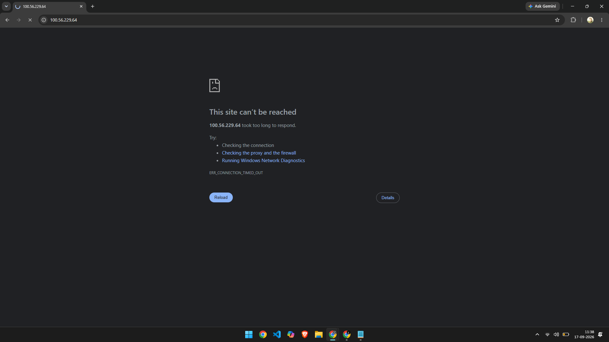
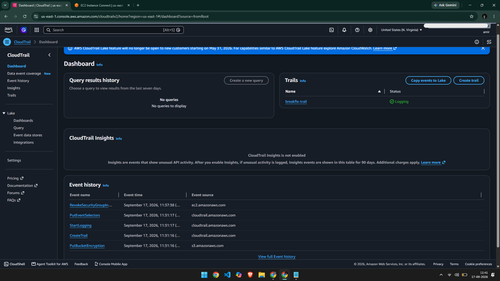
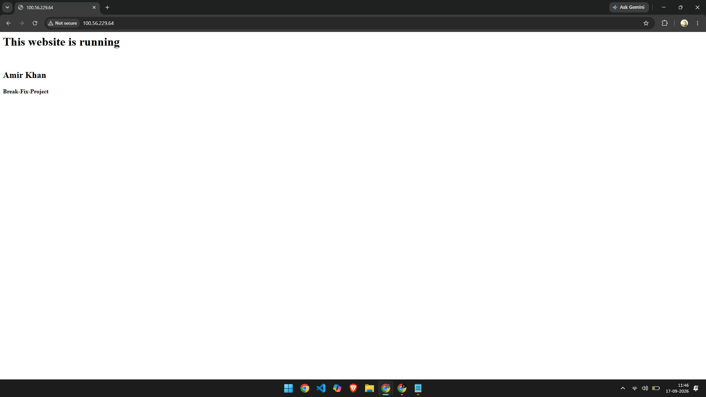

# Ticket #001 — HTTP Access Outage

**Priority:** High
**Status:** Resolved

## Issue
Website (`http://<public-ip>`) became unreachable. Browser showed "This site can't be reached — took too long to respond."

## Cause
The HTTP (port 80) inbound rule was removed from the EC2 instance's Security Group, blocking all public web traffic to the server. Apache itself was still running — the outage was purely network-layer, not application-layer.

## Diagnosis
Checked CloudTrail Event History and found the exact API call responsible:

- **Event:** `RevokeSecurityGroupIngress`
- **Confirmed:** Security Group ID, port removed, IAM user, and timestamp

This confirmed the root cause was a Security Group change, not a server crash — meaning no need to touch the EC2 instance or Apache config at all.

## Resolution
Re-added an inbound rule for HTTP (80), source `0.0.0.0/0`, to the Security Group. Verified the fix by reloading the site in an incognito browser window.

## Time to Resolve
~5 minutes

## Takeaway
Network-layer issues (Security Groups, NACLs) should be ruled out before assuming an application or server problem — a healthy running server can still be fully unreachable if its Security Group blocks the port.

## Challenges I Ran Into
While setting up SSH access earlier for this same instance, restricting the Security Group's SSH rule to "My IP" broke my connection entirely — I was connecting through the AWS Console's browser-based EC2 Instance Connect, not a local terminal. With that method, AWS's own backend servers make the SSH connection to the instance on your behalf, not your actual computer. Setting the rule to "My IP" only allows traffic from your home network's IP, so it silently blocked AWS's own connecting servers. Fix: added a separate SSH inbound rule with a Custom source set to AWS's EC2 Instance Connect IP range for the region (`18.206.107.24/29` for us-east-1), which let the browser-based connection through securely without opening SSH to the entire internet. Good reminder that "restrict to My IP" only works cleanly if you're SSHing from your own machine directly — browser-based connect methods need the provider's IP range allowed instead.
