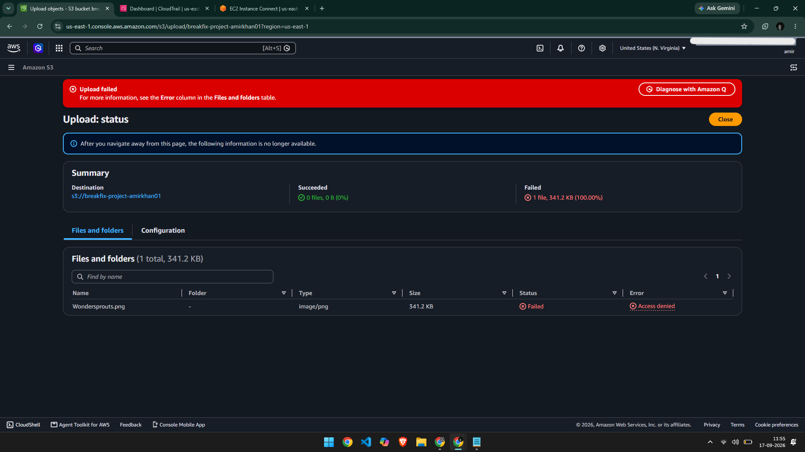
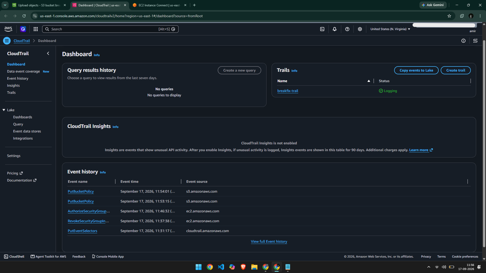
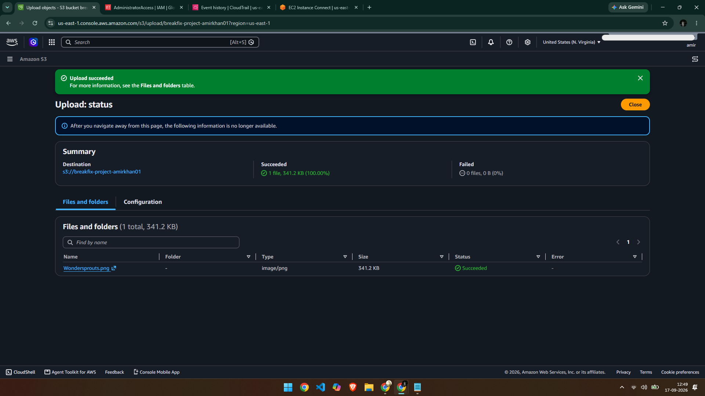

# Ticket #002 — S3 Bucket Access Outage

**Priority:** High
**Status:** Resolved

## Issue
File uploads to the S3 bucket failed with "Access Denied," even though the IAM user performing the upload had `AdministratorAccess`.

## Cause
A bucket policy explicitly denying all `s3:*` actions to all principals (`"Principal": "*"`) had been applied to the bucket. An explicit Deny in a resource-based policy overrides any Allow — including full account AdministratorAccess — so no IAM permission level could bypass it.

## Diagnosis
CloudTrail Event History captured the policy change directly:

- **Event:** `PutBucketPolicy`
- **Confirmed:** Bucket name, the exact Deny statement added, user, and timestamp

## Complication
Attempting to fix this by editing the bucket policy also failed with "not have permission" — because the Deny policy blocked *everyone*, including the bucket owner's IAM identity, from modifying the policy itself. Recovery required using the AWS root user, which retains override ability that bucket policies alone can't fully block.

## Resolution
Logged in as the AWS root user and deleted the Deny bucket policy entirely (no replacement Allow policy was needed — the IAM user's existing AdministratorAccess was already sufficient for normal same-account access). Verified the fix by re-uploading the test file successfully.

## Time to Resolve
~10 minutes (including root-user recovery step)

## Takeaway
Explicit Deny in a bucket policy overrides IAM permissions entirely, and a broad `Principal: "*"` Deny can lock out the bucket owner too. The fix is to remove the Deny, not to layer an Allow on top — and severe lockouts may require root-user access to recover.

## Challenges I Ran Into
My first instinct when I got locked out was to try writing an explicit **Allow** policy for `Principal: "*"` to counter the Deny — that instead triggered a separate conflict with S3's "Block Public Access" setting, which correctly refused to let any public-facing policy through. It took a moment to realize the fix wasn't "add an Allow," it was simply "remove the Deny" — my own IAM permissions were already enough once the conflicting policy was gone. Also spent a few minutes confused about why CloudTrail showed my regular IAM username ("amir") instead of the `breakfix-admin` user I'd created — turned out I'd been logged into the console under my normal login the whole time rather than switching to that IAM user's own sign-in session.
