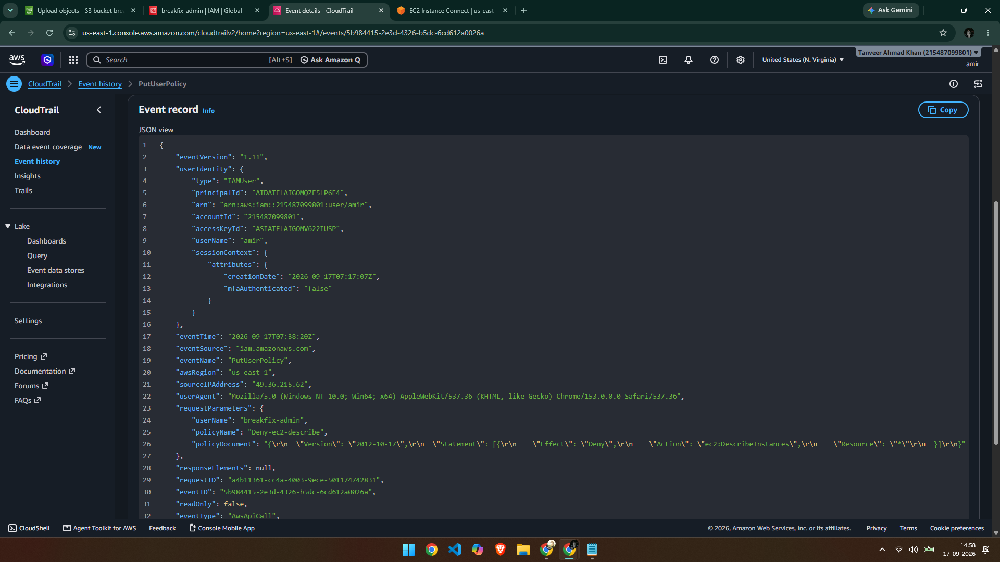

# Ticket #003 — EC2 Console Access Denied

**Priority:** Medium
**Status:** Resolved

## Issue
The EC2 Instances page displayed: "You are not authorized to perform this operation."

## Cause
An inline IAM policy (`deny-ec2-describe`) explicitly denying the `ec2:DescribeInstances` action had been attached to the user. This overrode the user's existing `AdministratorAccess`, blocking only this specific action while leaving the rest of the account's permissions intact.

## Diagnosis
CloudTrail Event History confirmed the exact change:

- **Event:** `PutUserPolicy`
- **Confirmed:** Policy name (`deny-ec2-describe`), affected user, and timestamp

**Note:** The resulting `UnauthorizedOperation` read-call error was not independently visible in CloudTrail Event History — a known limitation where some read-only ("Describe"/"List") API failures aren't consistently logged the way write actions are. Root cause was confirmed instead via the policy-creation event, which directly explained the observed error.

## Resolution
Removed the inline `deny-ec2-describe` policy from the IAM user's permissions. Verified the fix by reloading the EC2 console — instance list displayed normally.

## Time to Resolve
~15 minutes

## Takeaway
Write actions (Put/Attach/Delete) log reliably in CloudTrail and are often the more useful diagnostic signal — even when the resulting read-only error itself isn't independently captured, the policy-change event alone is enough to establish root cause.

## Challenges I Ran Into
I spent a good while hunting for the exact `UnauthorizedOperation` event in CloudTrail, expecting it to show up the same way the policy-change events did. I kept finding a `DryRunOperation` event instead (a routine console pre-check, not a real error) and widened my time filters, cleared filters, and searched by username — but the actual failed `DescribeInstances` call never appeared in Event History. Rather than get stuck on it, I pivoted to using the `PutUserPolicy` event as root-cause proof instead, since it directly showed the Deny policy being created. It was a useful lesson that not every failed API call gets logged the same way, and a good diagnosis sometimes means using the evidence that *is* available rather than the one you expected to find.
