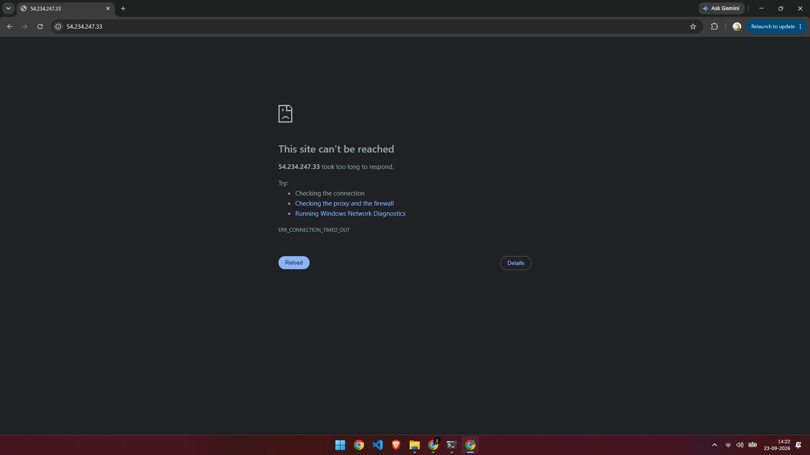
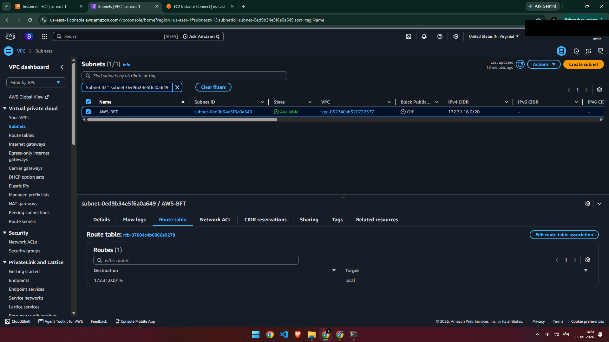
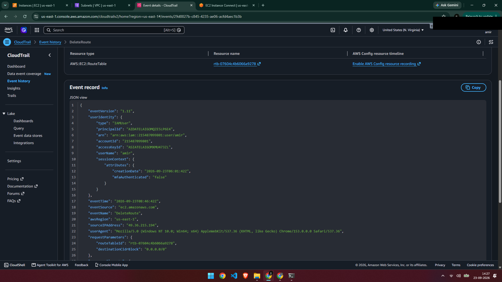
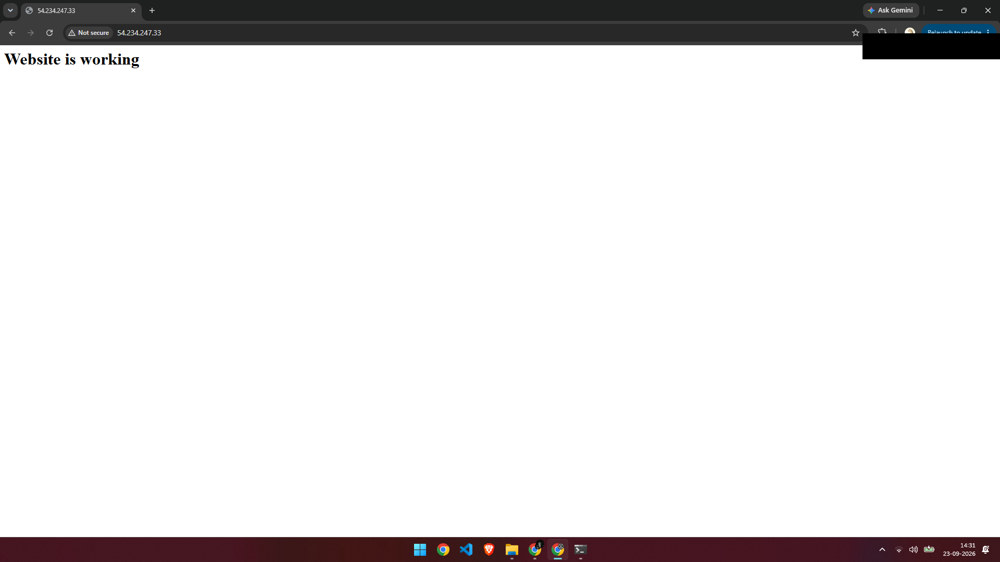

# Ticket #004 — Website/SSH Unreachable (Connection Timeout)

**Priority:** High
**Status:** Resolved

## Issue
The website (over HTTP) and SSH access to the EC2 instance both became unreachable. The browser returned `ERR_CONNECTION_TIMED_OUT`, and SSH attempts hung until timing out, rather than being immediately refused.

## Cause
The subnet's route table had its `0.0.0.0/0 → Internet Gateway` route removed, leaving only the default `local` route. With no route out of the subnet, traffic to and from the public internet had nowhere to go — which is why both HTTP and SSH timed out instead of connecting or being actively refused.

## Diagnosis
A timeout (rather than "connection refused") was the first clue: it meant packets weren't reaching the instance at all, pointing to a network-path issue rather than an application problem.

CloudTrail Event History confirmed the exact change:

- **Event:** `DeleteRoute`
- **Confirmed:** The specific route (`0.0.0.0/0`) removed, the route table affected, and the timestamp

## Resolution
Re-added the missing route in the subnet's route table: Destination `0.0.0.0/0`, Target set to the VPC's Internet Gateway. Verified the fix by reloading the website and reconnecting over SSH — both worked normally within a minute.

## Time to Resolve
~10 minutes

## Takeaway
A timeout vs. "connection refused" tells you where in the network path to start looking. Refused means the packet reached the instance and something there rejected it (no service on that port, or an OS-level firewall). A timeout means the packet never got a response at all — the problem sits upstream, in routing, security groups, or NACLs, before traffic ever reaches the instance.

## Challenges I Ran Into
It wasn't immediately obvious whether the timeout was caused by the route table, the security group, or a NACL — all three can produce the same symptom from the browser/SSH side. I had to check the route table first since it was the simplest to rule in or out, and confirmed via CloudTrail's `DeleteRoute` event that this was in fact the change that caused the outage, rather than guessing based on the symptom alone.
