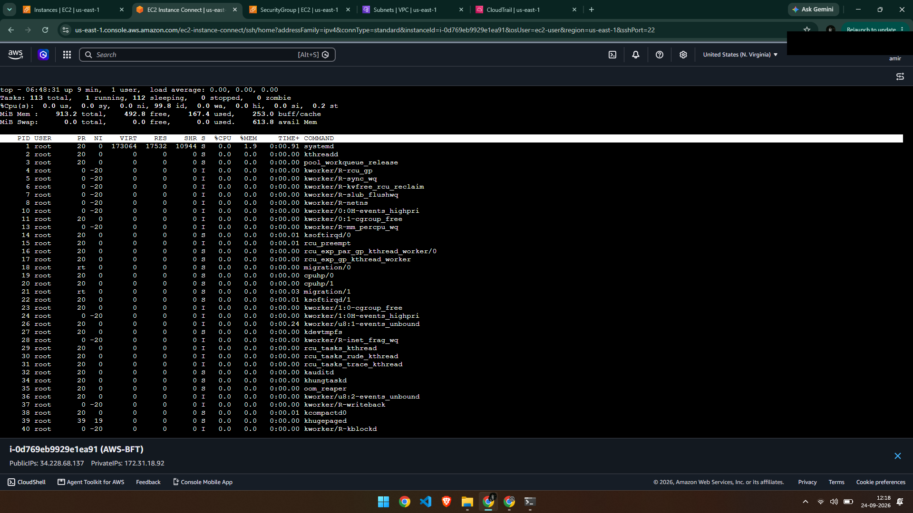
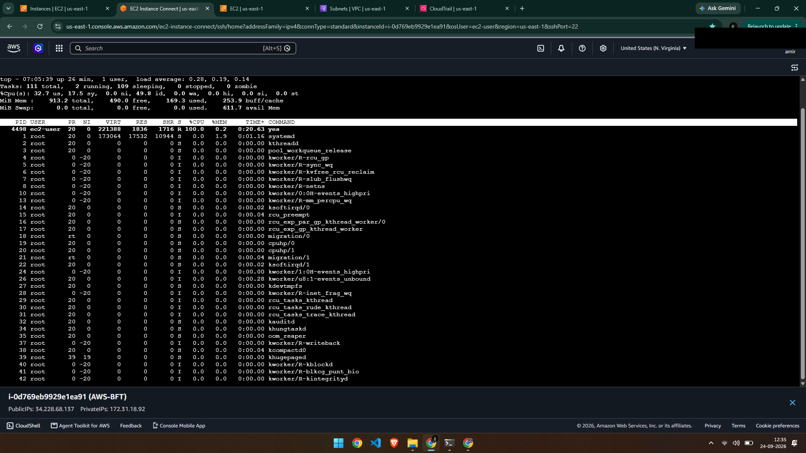
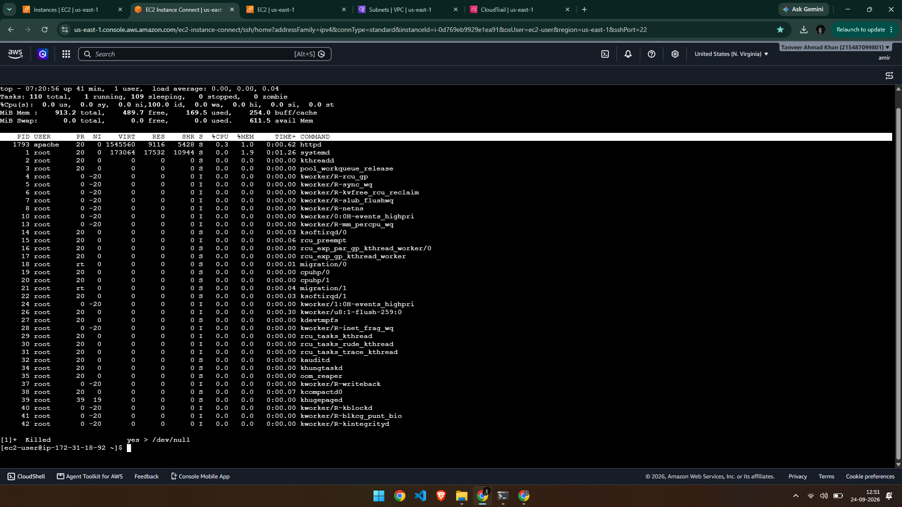

# Ticket #005 — High CPU Usage / Unresponsive Server

**Priority:** High
**Status:** Resolved

## Issue
The EC2 instance became sluggish, with commands and the terminal session responding very slowly. CPU usage needed to be investigated as the likely cause.


## Cause
A runaway process (`yes`) was consuming 100% of a CPU core continuously. This simulated a common real-world scenario where a misbehaving or runaway process consumes all available CPU, starving other processes (including the application and even the terminal session itself) of resources.

## Diagnosis
Ran `top` to view live process activity. The output clearly showed the `yes` process at the top of the list, consuming `100.0%` CPU, with `%Cpu(s)` confirming high overall CPU usage across the system.

Normal baseline before the incident:



During the incident, with the `yes` process at the top:



## Resolution
Identified the PID of the `yes` process from the `top` output and terminated it with:
```
kill -9 <PID>
```
`SIGKILL` (`-9`) was used since this signal cannot be ignored or caught by the process, guaranteeing immediate termination. Verified the fix by running `top` again — CPU usage dropped back to near idle and the `yes` process no longer appeared in the list.



## Time to Resolve
~10 minutes

## Takeaway
`top` is the fastest way to identify which process is responsible for high CPU usage, and `kill -9` (SIGKILL) is the reliable way to force-terminate a process that isn't responding to a normal `kill` (SIGTERM). This mirrors a very common real support scenario: "the server is slow" almost always starts with checking `top` before anything else.

## Challenges I Ran Into
My first attempt at this incident was interrupted when my SSH session (via EC2 Instance Connect in the browser) got stuck while `top` was running under CPU load, and refreshing the browser tab dropped the session. Since the `yes` process was started directly in that shell without `nohup`/`disown`, it was tied to the session and got killed automatically when the session dropped (via SIGHUP) — before I could kill it deliberately. I restarted the incident in a fresh session, this time keeping the terminal stable throughout, so the fix here reflects an intentional `kill -9` rather than an accidental side effect. This was still a useful lesson: background processes started without `nohup`/`disown` don't necessarily survive a dropped session, which isn't always true for real rogue processes in production (some do survive and keep running unattended), so it's worth checking explicitly in a real incident rather than assuming either way.
