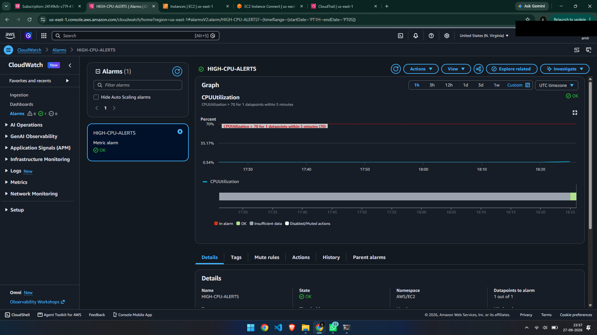
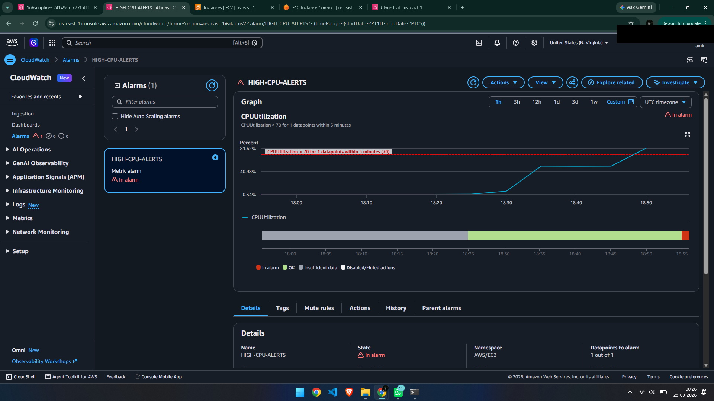
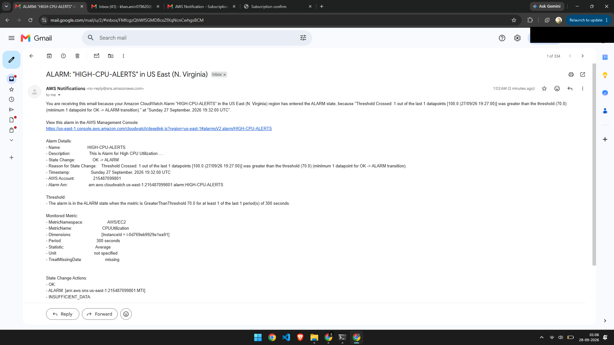
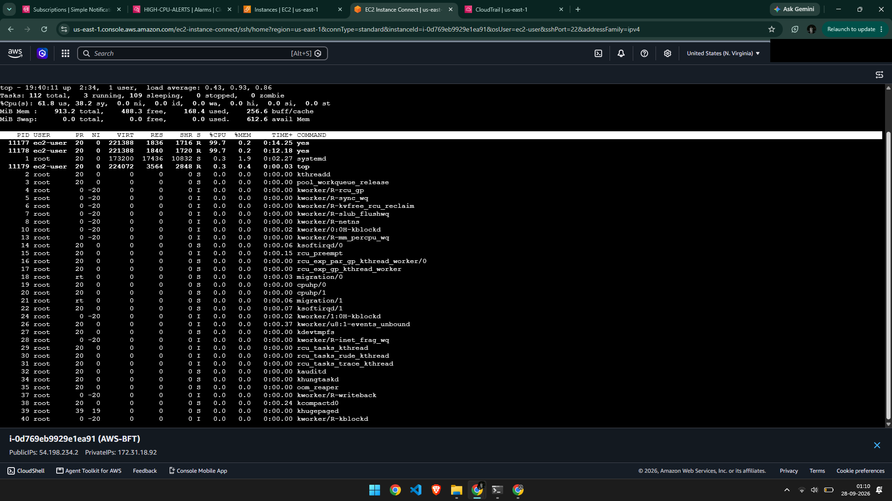
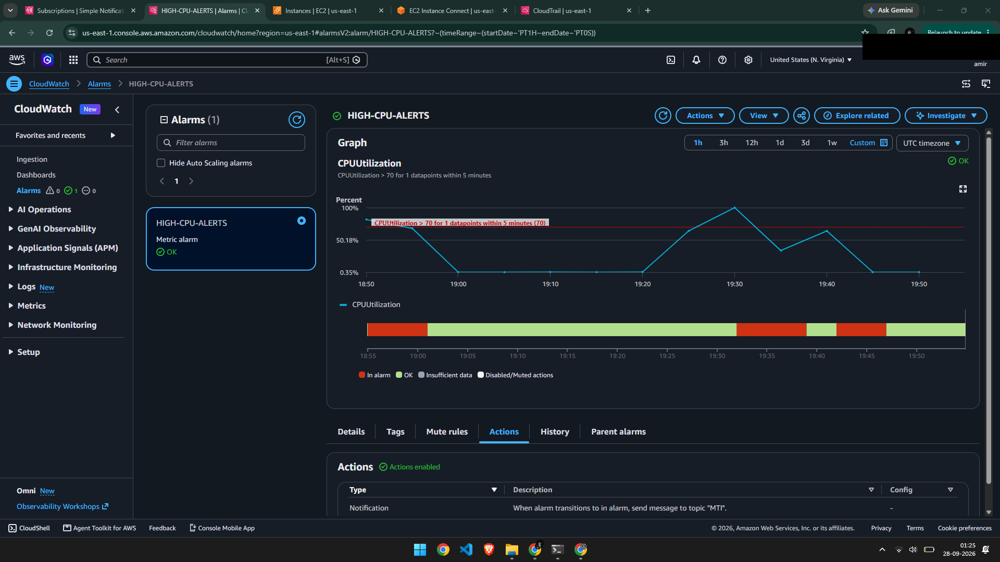

# Ticket #006 — High CPU Detected via CloudWatch Alarm

**Priority:** High
**Status:** Resolved

## Issue
Received a CloudWatch alarm notification (via SNS email) indicating high CPU utilization on the EC2 instance. Unlike previous incidents, this one was detected proactively through monitoring rather than by manually noticing a problem.

A CloudWatch alarm (`HIGH-CPU-ALERTS`) had been configured in advance to trigger when `CPUUtilization` exceeds 70%, with an SNS topic set up to send an email notification when the alarm state changes.

Shortly after, the alarm transitioned to "In alarm" and the configured notification was received.

## Cause
A runaway process (`yes`) was again consuming CPU across both vCPUs, pushing overall instance `CPUUtilization` above the configured alarm threshold of 70%.

## Diagnosis
Upon receiving the alarm notification, connected to the instance and ran `top` to investigate — the same starting point as any real support ticket triggered by a monitoring alert. The output identified two `yes` processes consuming close to 100% CPU each, together driving the instance-wide average above the threshold.

## Resolution
Identified the PIDs from the `top` output and terminated both processes with `kill -9 <PID>`. Confirmed CPU usage dropped back to normal via `top`, and waited for the next CloudWatch evaluation period, after which the alarm returned to "OK" state automatically.

## Time to Resolve
~20 minutes (including the CloudWatch evaluation period delay before the alarm cleared)

## Takeaway
Monitoring and alerting change the shape of an incident: instead of discovering a problem by noticing symptoms (a slow site, a failed request), the alert itself is the first signal, and investigation starts from there. This is closer to how real production support work operates — CloudWatch alarms exist specifically so issues are caught and investigated before a customer notices or reports them. It also reinforced the difference between per-process and instance-wide CPU metrics: a single maxed-out core can look very different in `top` (100% for one process) versus CloudWatch's instance-wide average (which divides load across all vCPUs).

## Challenges I Ran Into
Setting up the SNS email subscription took longer than expected — an earlier subscription showed a "Confirmed" status but its ID displayed as "Deleted" in the console, and continued sending unsubscribe-related emails instead of alarm notifications. Deleting that subscription entirely and creating a fresh one resolved it. Separately, hitting the CPU threshold required running two `yes` processes rather than one, since a single process only maxes out one vCPU core, while CloudWatch's `CPUUtilization` metric reports the average across all cores on the instance.
